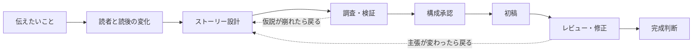

# inkduet プロダクトブリーフ

`inkduet`は、人とAIが二人で一つの記事を仕上げる記事作成ハーネスである。AIによる代筆ではなく、
書き手が主導し、AIと構想・調査・執筆・推敲を往復する関係を、二人で演奏する「duet」と
書く行為を表す「ink」で表現する。

## 一文でいうと

**伝えたいことを、ストーリー設計・調査・執筆・レビュー・修正を経て、公開可能な記事へ
変える専用AIワークスペース。**

## 誰のためのものか

伝えたいテーマや問題意識はあるが、構成・調査・執筆・修正をAIとのチャットで何度も
往復している個人の書き手。最初の代表ユーザーは、このハーネスの開発者本人とする。

代表シナリオは、数行の粗いメモや会話から技術記事の制作を始め、途中の調査や検証で
当初の仮説が変わる可能性も受け入れながら、本人が納得して公開できる原稿まで完成させること。

## 解く問題

現在のチャット中心の制作では、読者、主張、ストーリー、原稿、レビュー指摘、採否判断が
会話の中へ分散する。工程を進むほど最新の意図と判断状態を見失い、同じ説明のやり直し、
修正指示の言語化、変更箇所の再確認に時間がかかる。初稿は作れても、記事全体を一貫させて
「完成」と判断できる状態へ収束させにくい。

## プロダクト仮説

記事の意図・ストーリー・原稿・根拠・レビュー・変更状態を一つの制作フローとして管理し、
人間が重要な分岐だけを選択・承認できれば、チャットだけで制作する場合より少ない判断負荷で、
伝えたいことを保った記事を完成させられる。

AIが自律的に記事を完成させることは目指さない。AIは選択肢の生成、調査、執筆、レビュー、
影響範囲の検出を担い、人間は伝えたいこと、ストーリー、修正の採否、完成を判断する。

## なぜSkillだけではないか

記事制作の手順だけなら、Codex Skillで最後まで実行できる。専用アプリの価値は生成能力ではなく、
会話へ流れやすい中心主張、ストーリー、原稿、レビュー、採否、確認済み範囲を同時に見せ、
対象選択、案比較、部分採用、差分承認という人間の判断を直接操作へ変えることにある。

したがって、検証すべき問いは「記事を完成できるか」ではなく、**人間の比較・選択・承認を
チャットより少ない負担で行えるか**とする。Markdown、Git差分、会話上の要約だけで十分なら、
専用アプリは不要であり、Skillだけを残す。

## 中心体験

- **伝えたいことを明確にする**: 粗いメモから、問題意識、想定読者、読後の変化、制約を整理する。
- **ストーリーを設計する**: 読者の問題意識から記事のアンサーへ至る切り口と、各見出しの役割を決める。
- **根拠を確かめる**: 必要な調査・技術検証を行い、仮説が崩れたらストーリーへ戻る。
- **記事として書く**: 承認したストーリーと根拠から初稿を生成する。
- **完成へ収束させる**: レビュー指摘を原稿へ結び付け、対象選択、修正意図、案比較、差分承認で直す。
- **完成を判断する**: 主張、ストーリー、本文、まとめ、根拠の整合性を確認し、人間が最終OKを出す。

## ハッカソンMVP

一つのサンプル入力を使い、次の縦断体験を最後まで動かす。

1. 数行の「伝えたいこと」を入力する。
2. AIが想定読者、読後の変化、中心主張、ストーリー案を提示する。
3. 人間がストーリーを選択・修正して承認する。
4. 承認したストーリーから初稿を生成する。
5. 原稿の一箇所以上を選び、修正意図を指定して複数案を比較する。
6. 採用案の差分と全体への影響を確認して反映する。
7. 未確認の変更がないことを確認し、人間が記事の完成を宣言する。

各工程を作り込むことより、意図から完成まで状態が途切れず、前工程へ戻っても最新の主張と
原稿の対応を見失わないことを優先する。

M0aではモックデータで全体UXを検証し、M0bで実モデルによる薄いウォーキングスケルトンを通す。
M1〜M4は各工程の完了条件として実モデルを複数ケースで評価する。M5は初回のモデル接続ではなく、
工程別に較正した体験を統合し、チャットより判断負荷を減らせたかを評価する。

実装は機能別ではなく、完了時に一段の体験が通る次のIssueで進める。

1. [M0a: アプリ全体のUXプロトタイプ](https://github.com/maguroid/inkduet/issues/12)
2. [M0b: App Server接続と記事状態モデル](https://github.com/maguroid/inkduet/issues/18)
3. [M1: 伝えたいことからストーリー承認](https://github.com/maguroid/inkduet/issues/13)
4. [M2: 承認済みストーリーから初稿生成](https://github.com/maguroid/inkduet/issues/14)
5. [M3: 対象選択・複数案比較・採用](https://github.com/maguroid/inkduet/issues/15)
6. [M4: 差分・影響範囲の確認と完成宣言](https://github.com/maguroid/inkduet/issues/16)
7. [M5: サンプル記事での完走と価値評価](https://github.com/maguroid/inkduet/issues/17)

課題・機能仮説を表す`BL-*` Issueは、各M Issueから参照する。BL Issue自体を実装進行の
単位にせず、Dev BoardにはM Issueだけを載せる。

## 実現方式

記事制作の知識は一つの`article-writing-core` Skillへ分離し、アプリへ同梱してバージョンを
固定する。App ServerクライアントがSkillを明示的に指定して呼び出し、暗黙の発動や利用者の
普段使い環境に入っているSkillへ依存しない。

| 層 | 所有するもの |
| --- | --- |
| `article-writing-core` Skill | 読者設定、ストーリー設計、執筆、レビュー、修正、完成判定の原則・テンプレート・参考資料 |
| 専用アプリ | 制作フェーズ、記事データ、状態遷移、承認、版・差分、採否、確認状態、計測、UI |
| `developerInstructions` | 指定フェーズだけを処理する、人間の承認を推測しない、アプリの状態を正本とする等の実行契約 |
| `outputSchema` | 各フェーズからアプリへ返す構造化データの機械的な契約 |

Skill自身はフェーズを進めず、アプリも記事制作の判断基準を重複して持たない。MVPでは工程別に
複数Skillへ分割せず、一つのSkillからフェーズ別の参考資料を読む。独立利用の需要が確認できた
工程だけを後から別Skillへ切り出す。

## MVPでやらないこと

- 調査・出典検証の完全自動化
- CMSや投稿サービスへの公開
- 複数人での共同編集
- 図解・画像の生成と編集
- 過去の採否からの長期的な好み学習
- 汎用ワークフローエディタ
- 複数記事の同時進行管理

## 成功条件

- 数行の入力から完成判断まで、一つの記事制作を中断せず完走できる。
- どの時点でも、最新の中心主張、ストーリー、原稿、未確認変更が分かる。
- ストーリーと初稿を人間が明示的に承認できる。
- 原稿の修正前後と影響範囲を確認し、採用・却下を判断できる。
- 人間の最終OKなしに完成扱いにならない。

主指標は、制作開始から本人が最終OKを出すまでの時間。補助指標として、意図の再説明回数、
自由記述の修正指示回数、再生成回数、最終確認で読み直した範囲を記録する。

## 判断履歴と関連資料

- **2026-07-18 ユーザー判断**: 実モデルに接続しなければ見えない課題をM5まで持ち越さない。
  Before: M0aのモックUX、M0bの技術接続、M1〜M4の縦断実装を経て、M5で実利用を評価する。
  After: M0bで仮UIから実モデルへ接続する薄いウォーキングスケルトンを通し、M1〜M4の各Done条件にも
  実モデル評価を入れる。M5は較正済み工程の統合価値だけを評価する。出力変動、構造化出力の逸脱、
  待ち時間、失敗・再試行、UXへの影響を早期かつ継続的に状態モデルと操作へ戻すため。
- **2026-07-18 ユーザー判断**: App Server接続と状態モデルの実装より先に、サンプルデータで
  記事制作全体を操作できるクリック可能なUXプロトタイプを作る。Before: 技術基盤をM0とし、
  画面と操作は各縦断Issueで順に実装する。After: M0aで全体フロー、情報設計、中心編集ループ、
  承認点を確定し、M0bで採用したUXから状態モデルと入出力を逆算する。専用アプリの最大の
  不確実性はApp Server接続ではなく、比較・選択・承認をチャットより少ない負担で行えるかに
  あるため。配色や細かな造形はこの段階では固定しない。
- **2026-07-18 ユーザー判断**: プロジェクト名を`inkduet`に決定した。Before: 執筆感を
  前面に出す`tsuzuru`や、人間を一本目・AIを二本目のペンと捉える`secondpen`などを検討した。
  After: 人とAIが二人で一つの記事を仕上げる関係を、共同演奏として表す`inkduet`を採用した。
  理由は、AIへの一方向の生成依頼ではなく、構想から完成まで往復しながら共作するプロダクトの
  中心体験を、執筆と二人組の両方のニュアンスで表せるためである。
- **2026-07-18 ユーザー判断**: SkillかAppかを二者択一にせず、記事制作の知識はSkill、
  制作状態と人間の判断操作はAppが所有する構成にした。Skillをアプリへ同梱して明示的に
  呼び出し、同じ制作知識を通常のCodexからも再利用できるようにする。
- **2026-07-18 ユーザー指摘/判断**: 修正は重要だが、修正だけに特化しない。修正IDEを
  プロダクト全体とする案から、「伝えたいこと」を起点に記事として完成するまでを完結させる
  記事作成ハーネスへ変更した。理由は、完結させたい仕事が修正単体ではなく記事制作全体だからである。
- [編集工程の現行プロセスと課題定義](./editorial-workflow.md)
- [実モデル接続時の較正ログ](./model-calibration.md)
- [課題・機能仮説（BL Issues）](https://github.com/maguroid/inkduet/issues?q=is%3Aissue%20state%3Aopen%20label%3Akind%3Ahypothesis)
- [MVP実装単位（M Issues）](https://github.com/maguroid/inkduet/issues?q=is%3Aissue%20state%3Aopen%20label%3Akind%3Adelivery)
- [App Serverの技術設計](./app-server-architecture.md)
